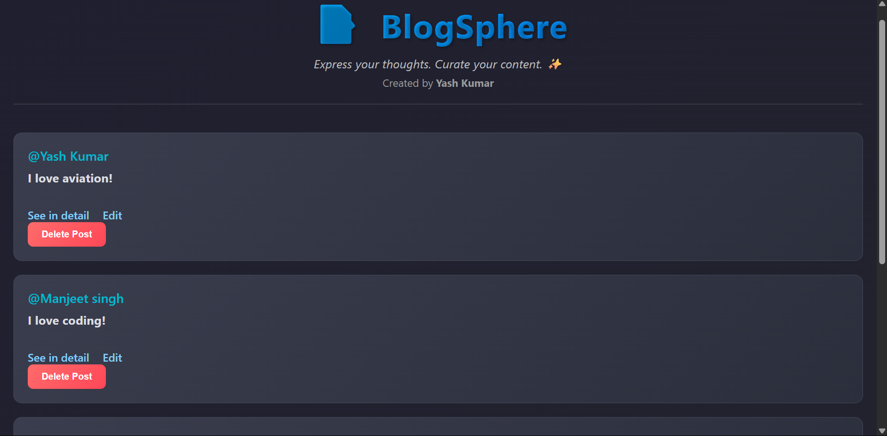

# 📝 BlogSphere

**BlogSphere** is a minimalistic and beautifully styled personal blogging platform where users can create, edit, view, and delete short blog-style posts. It’s built using **Node.js**, **Express**, **EJS**, and RESTful routing principles — perfect as a mini full-stack project or portfolio showcase.

---

## 🌟 Features

- 🔹 Create new blog posts with username and content
- 🔹 View all posts on the homepage
- 🔹 Edit existing posts
- 🔹 Delete posts securely
- 🔹 View post details on a separate page
- 🔹 Dark mode aesthetic UI with vibrant colors
- 🔹 RESTful API routing and server-side rendering (SSR) using **EJS**

---

## 🚀 Tech Stack

- **Backend:** Node.js, Express.js
- **Frontend:** HTML5, CSS3, EJS templates
- **Utilities:** UUID for unique post IDs, Method-Override for PATCH/DELETE

---

## 📂 Folder Structure

blogsphere/
├── public/
│ └── style.css # App-wide styling
├── views/
│ ├── index.ejs # All posts view
│ ├── new.ejs # Form to create post
│ ├── show.ejs # Post detail view
│ └── edit.ejs # Edit post form
├── app.js # Main Express app
└── README.md # You're reading it :)
