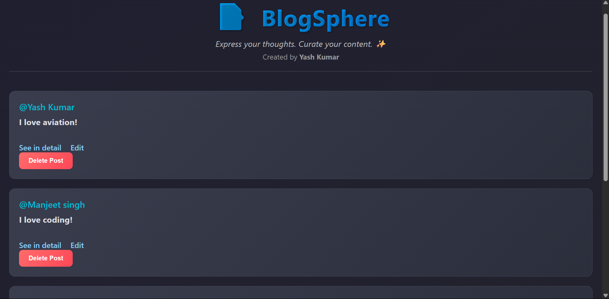

# 📝 BlogSphere

**BlogSphere** is a minimalistic and beautifully styled personal blogging platform where users can create, edit, view, and delete short blog-style posts. It’s built using **Node.js**, **Express**, **EJS**, and RESTful routing principles — perfect as a mini full-stack project or portfolio showcase.

## 🌐 Live Demo

🚀 [View Deployed Project on Render](https://blogsphere-tnir.onrender.com/)

---

---

## ✨ Features

- Create, edit, and delete blog posts
- RESTful routing using Express
- Server-rendered HTML using EJS templates
- Modern, responsive design with light/dark aesthetic
- Favicon and dynamic page titles
- Clean folder structure
- Deployed via Render

---

## 🛠️ Tech Stack

- **Backend:** Node.js, Express
- **Templating Engine:** EJS
- **Styling:** CSS
- **Deployment:** Render

---

## 📂 Folder Structure

mini-blog-crud/
│
├── public/
│ └── assets/
│ └── logo.png
│ └── preview.png
│ └── style.css
│
├── views/
│ ├── index.ejs
│ ├── new.ejs
│ ├── show.ejs
│ └── edit.ejs
│
├── app.js
├── package.json
└── README.md
